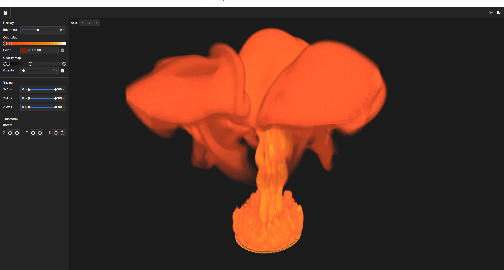

# Volumetric Renderer

A web-app for rendering volumetic datasets. App is available [here](https://tombeacock.github.io/volumetric-renderer-web/).

## Supported File Types

- Nearly Raw Raster Data (.nrrd) (3D / 4D Temporal).
- DICOM (.dcm) (Sorted 2D slices).

Some example NRRD datasets are available at: <https://klacansky.com/open-scivis-datasets/>

## Features

- Full 3D navigation (pan, zoom, orbit).
- User editable transfer function.
- Volume slicing on individual axes.
- Volume rotation.
- Adjustable playback of temporal datasets.

